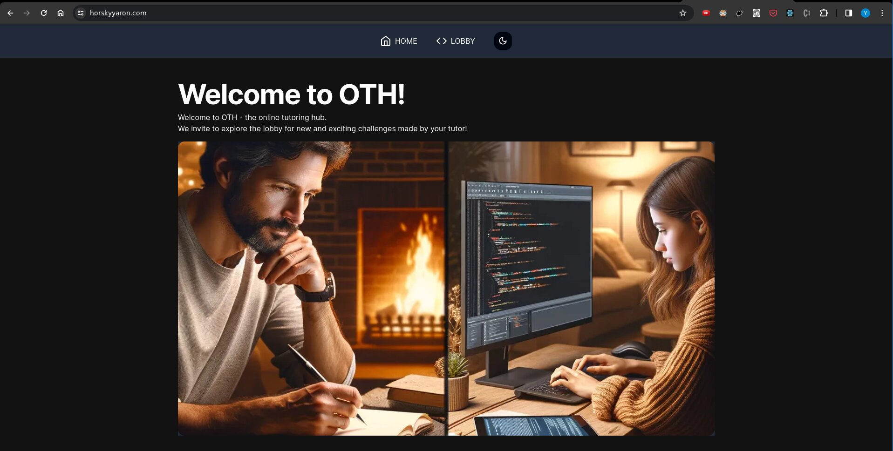

# OTH - online tutoring hub

OTH is a web application for online tutoring where the student can write code
and the tutor can only watch the studnt write in **realtime** using **websockets**.

The application is deployed over at [horskyyaron.com](https://horskyyaron.com) go check it out for yourself :)

## Tools used

* supabase - DB
* prisma - ORM
* next.js - React framework
* vercel - Deployment
* aws-ec2 instance - Node application server
* express - https/wss node server.
* typescript/javascript - Programming languages.
* socket.io - WebSockets library.
* shadnc-ui - A very cool UI library.

### Node server

You can find the node server in my other repo [online-tutor-server](https://github.com/horskyyaron/online-tutor-server) 

